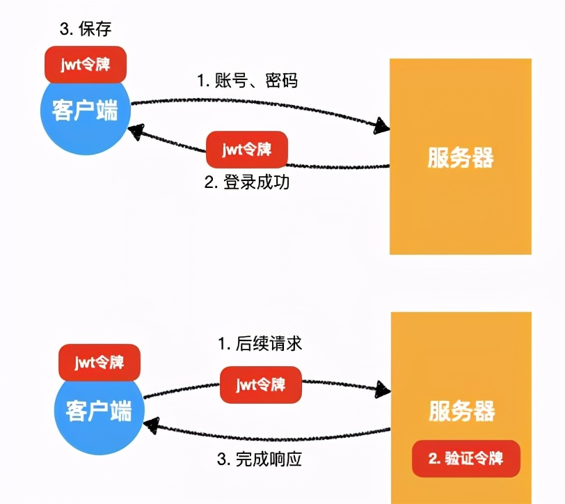
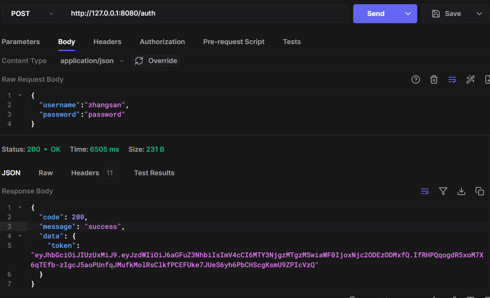
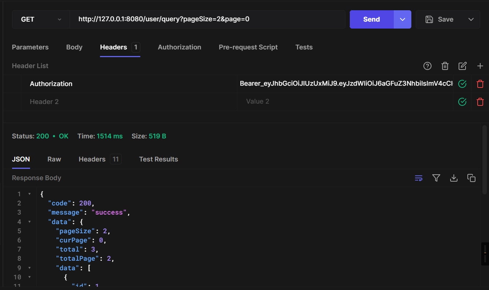
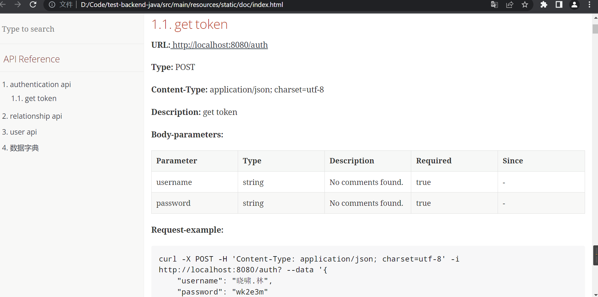
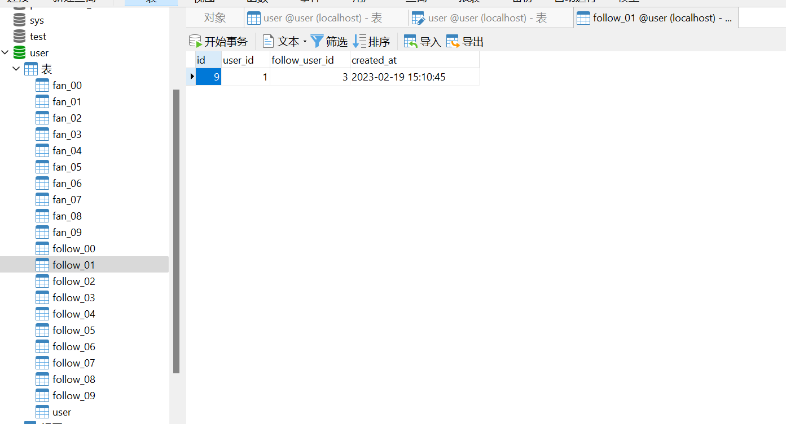
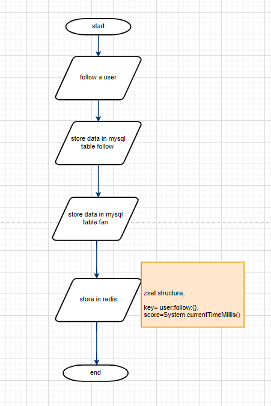
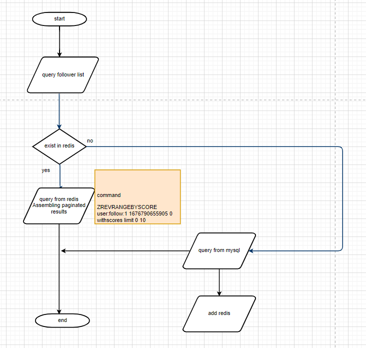

# Overview
This system implements the RESTful api that can add, delete, modify and query user data from a persistence database. Follow or unfollow somebody.

## Pre-requisites
jdk 1.8+

mysql 5.7+

Maven 3+

Redis

After installing the above environment, import the user.sql file in the test-backend-java directory into the MySQL database

### creat user
First of all, you need to user ``/user/create`` to create a user, use this user to obtain token, and then access other api
```
curl --request POST \
  --url http://127.0.0.1:8080/user/create \
  --header 'content-type: application/json' \
  --data '{
  "name": "zhangsan",
  "password": "password",
  "dob": "2010-01-17",
  "address": "上海",
  "description": "爱好旅游，看书"
}'
```

### Authentication
This project uses SpringBoot + SpringSecurity + JWT to authenticate and authorize the restful api.
Therefore, before calling other api, you need to obtain a token.

Authentication interaction process

Use the user name and password created above to call `/auth` api to obtain the token
```
curl --request POST \
  --url http://127.0.0.1:8080/auth \
  --header 'content-type: application/json' \
  --data '{
  "username":"zhangsan",
  "password":"password"
}
```

You will get a result as bellow


### access other api
Add the token obtained above to the http header `Authorization` and add prefix `Bearer_` before the token
```
curl --request GET \
  --url 'http://127.0.0.1:8080/user/query?pageSize=2&page=0' \
  --header 'Authorization: Bearer_eyJhbGciOiJIUzUxMiJ9.eyJzdWIiOiJ6aGFuZ3NhbiIsImV4cCI6MTY3NjgzMTgzMSwiaWF0IjoxNjc2ODEzODMxfQ.IfRHPQqogdR5xoM7X6qTEfb-zIgcJ5aoPUnfqJMufkMolRsClkfPCEFUke7JUeS6yh6PbCHScgKsmU9ZPIcVzQ'
```



## API Document
run test-backend-java, then you can access the api document through the following link
http://127.0.0.1:8080/doc/index.html

Or you can access `test-backend-java\src\main\resources\static\doc` directly

when you change or add new api you can run `mvn smart-doc:html` to generate API documentation.
API documentation is output to src/main/resources/static/doc.



## Followers/Following 
Compared with the number of users, the data of follower and following will be very large, because a user can follow many people, and a person may also be followed by many people. For example, some stars even have tens of millions of fans.
Therefore, follower and following data need to be stored in separate tables.

To simplify the process, I only created 10 tables for the following data. In actual use, we can create more tables such as 100. Then perform a modulo operation according to the user id to determine the stored table.

For example, if user 1 with id follows user 2, the data will be stored in follow_01.



Because the amount of follow data will be very large, in order to improve performance, the Redis zset structure is used to cache the follow data. 

When a user follow others, we need to store data in MySQL and Redis at the same time.


The query focus list is first obtained from Redis. If there is no data in Redis, it will be queried from MySQL.

